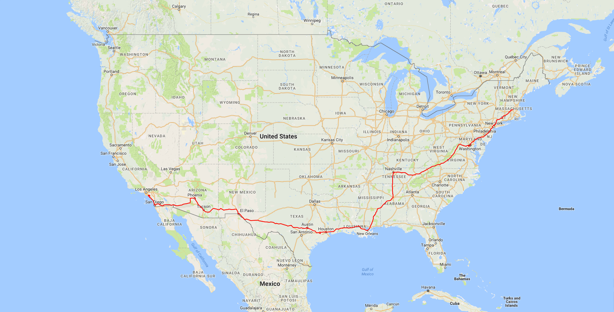

Road Trip Plots
==========================

## Description
In the past, I have done a few road trips through various parts of the country. This visualization is used to plot the actual routes I took in a [Google Maps](https://www.google.com/maps) view.

Google Maps has a [timeline](https://www.google.com/maps/timeline) feature which allows you to see your location history by year, month, and day. You can use [Google Takeout](https://takeout.google.com/settings/takeout) to download this data in a JSON format. It doesn't seem like you can plot a route across days or weeks in the Timeline view, so I wanted to do it myself.

### Notes

One of the main issues that comes up with this method of data collection is that depending on the location of the trip and the cell/GPS signal strength throughout the trip, it's possible that the data can be incomplete, noisey, or coarse in granularity. Otherwise, in general, the resulting map and route plots tend to be very clear and descriptive of the original data.

## Build
This project requires [Python 3.x](https://www.python.org/downloads/) as well as the following packages:

* [`gmplot`](https://github.com/vgm64/gmplot)

This project also requires the Google Takeout JSON file of location history. This can be done creating an archive of your Google data and only selecting your location history as the archive contents. This [link](https://takeout.google.com/settings/takeout/custom/location_history?hl=en&gl=US&expflags) should directly allow you to do this. Place the JSON file at `data/location_history.json` in the project folder.

## Usage

### Data Sanitization

To sanitize the JSON location data, simply run the sanitization script:

```
python .\sanitize_data.py -i <raw file from Google Takeout> -o .\data\<sanitized JSON file> -s <Start Epoch Unix timestamp of data> -e <End Epoch Unix timestamp of data>
```

This will produce a sanitized JSON file for just the minimum data required to plot the map.

For example:

```
python .\sanitize_data.py -i .\data\boston_sandiego_location_history_raw.json -o .\data\boston_sandiego_location_history.json -s 1495425600000 -e 1496030340000
```

produces the provided file [boston_sandiego_location_history.json](data/boston_sandiego_location_history.json).

### Map Plot

To plot the map, simply run the road trip plot script:

```
python .\road_trip_plot.py -i .\data\<sanitized JSON file> -o .\maps\<map HTML file> -s <Start Epoch Unix timestamp of data> -e <End Epoch Unix timestamp of data>
```

Once the map HTML file is generated, you'll need to add a Google Maps JavaScript API key. The [documentation and sample code](https://developers.google.com/maps/documentation/javascript/tutorial#The_Hello_World_of_Google_Maps_v3) demonstrates how to do this. Once this key is added to the URL in the map HTML file, the HTML file can be opened in any browser to view the plotted data.

## Output

An example of my road trip maps can be found below. There are more map images in the corresponding `img/` directories.

### Boston to San Diego


